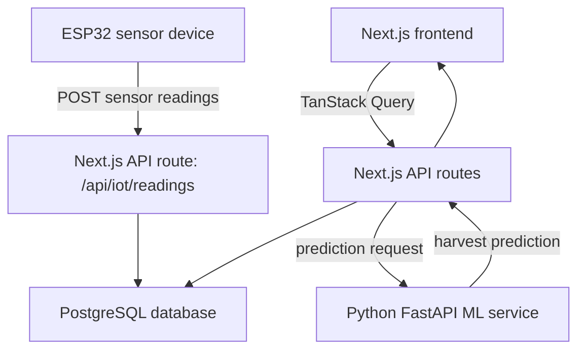

# Harvest Calendar Backend Architecture And Hardware Feasibility

## 1. Backend Feasibility Summary

The Harvest Calendar system is technically feasible with a simple backend architecture. The first real backend does not need many separate services. The recommended MVP is:

```text
ESP32 / sensor devices
  -> Next.js API routes
  -> PostgreSQL database
  -> Python ML inference API
  -> Next.js frontend
```

This means the same Next.js application can handle:

- Frontend pages.
- API routes for crops, sensors, feedback, and predictions.
- IoT ingestion endpoint for ESP32 readings.
- Proxy calls to the Python ML service.

The Python service stays separate because ML tooling is much stronger in Python.

## 2. Recommended MVP Architecture



## 3. Runtime Components

### 3.1 Next.js App

Language:

- TypeScript.

Framework:

- Next.js App Router.

Responsibilities:

- Render frontend pages.
- Expose API routes.
- Receive sensor readings from ESP32.
- Read and write database records.
- Proxy prediction requests to the Python ML API.
- Return normalized API responses to the frontend.

Why Next.js can also handle IoT ingestion for MVP:

- ESP32 only needs to send small JSON payloads.
- Sensor readings are low-frequency, usually every 1 to 5 minutes.
- Next.js API routes are enough for a proof of concept and early MVP.
- It reduces backend complexity while the product idea is still being validated.

When to split IoT ingestion later:

- Thousands of devices.
- High-frequency readings.
- MQTT requirements.
- Offline buffering.
- Device provisioning.
- Background stream processing.
- WebSocket live dashboards.

### 3.2 Python ML Service

Language:

- Python.

Framework:

- FastAPI.

ML libraries:

- scikit-learn for MVP.
- XGBoost or LightGBM later if useful.
- pandas and NumPy for feature processing.

Responsibilities:

- Receive crop batch data and sensor summaries.
- Run harvest-date inference.
- Return predicted harvest date, confidence, shift days, and contributing factors.
- Later, expose training or retraining endpoints.

Why Python should be separate:

- Python has the best ML ecosystem.
- The ML model can evolve independently from the frontend.
- Next.js does not need to load ML packages.
- The frontend API can keep working even if ML implementation changes.

### 3.3 PostgreSQL Database

Recommended database:

- PostgreSQL.

Optional extension:

- TimescaleDB if sensor time-series volume becomes large.

MVP database options:

- Supabase Postgres.
- Neon.
- Railway Postgres.
- Render Postgres.

Responsibilities:

- Store crop batches.
- Store plant profiles.
- Store farm locations.
- Store sensor devices and sensor groups.
- Store sensor readings.
- Store harvest predictions.
- Store user feedback.
- Store model learning metadata.

## 4. Hardware Architecture

### 4.1 Microcontroller Or Edge Device

Recommended MVP hardware:

- ESP32.

Why ESP32:

- Built-in Wi-Fi.
- Cheap and widely available.
- Works well with Arduino C++.
- Can read many common sensors.
- Can send HTTP requests to the backend.

Alternative:

- Raspberry Pi.

Use Raspberry Pi if:

- Camera/image processing is needed.
- Multiple ESP32 devices need a local gateway.
- Local buffering or local dashboard is needed.
- More compute is required.

For this project, ESP32 is enough.

### 4.2 Common Sensors

Recommended sensor set for vertical farming:

| Reading | Sensor Example | Purpose |
|---|---|---|
| Air temperature | SHT31, BME280, DHT22 | Tracks growth environment |
| Humidity | SHT31, BME280, DHT22 | Helps monitor transpiration and climate |
| pH | Analog pH probe + signal board | Measures water/nutrient acidity |
| EC/TDS | EC or TDS sensor module | Measures nutrient concentration |
| Light intensity | BH1750, VEML7700 | Estimates light exposure |
| Water temperature | DS18B20 | Useful for hydroponics |
| Water level | Float sensor or ultrasonic sensor | Prevents reservoir issues |
| Soil moisture | Capacitive moisture sensor | Useful only for soil-based systems |

For a hackathon hardware demo, use:

- ESP32.
- DHT22 or SHT31 for temperature and humidity.
- BH1750 for light.
- Mock pH and EC values if real probes are unavailable.

This gives enough credibility without drowning the team in calibration problems.

### 4.3 Optional Actuators

Actuators are not required for Harvest Calendar, but they are natural future extensions:

- Grow light relay.
- Water pump.
- Nutrient pump.
- Fan.
- Humidifier.
- Dehumidifier.

For the current product, the system predicts and learns. It does not need to control equipment yet.

## 5. ESP32 Firmware Feasibility

The ESP32 runs firmware code. It does not run JavaScript or Next.js.

Recommended language:

- Arduino C++.

Alternative:

- MicroPython.
- ESP-IDF C for more advanced embedded development.

Recommended for this team:

- Arduino C++ because it is common, hackathon-friendly, and has many sensor libraries.

The ESP32 behaves like a client:

```text
connect to Wi-Fi
read sensors
create JSON payload
send HTTP POST request to backend API
wait
repeat
```

The ESP32 should not write directly to the database.

Why:

- Database credentials should not live on a small device.
- Direct DB access is harder to secure.
- The device should not know database schema details.
- The backend should validate and normalize readings.

Correct flow:

```text
ESP32 -> Next.js API -> Database
```

Avoid:

```text
ESP32 -> Database
```

## 6. ESP32 HTTP Request Example

Example firmware shape using Arduino C++:

```cpp
#include <WiFi.h>
#include <HTTPClient.h>

const char* WIFI_SSID = "your-wifi-name";
const char* WIFI_PASSWORD = "your-wifi-password";

const char* API_URL = "https://your-domain.com/api/iot/readings";
const char* DEVICE_API_KEY = "device-secret-key";

void setup() {
  Serial.begin(115200);

  WiFi.begin(WIFI_SSID, WIFI_PASSWORD);

  while (WiFi.status() != WL_CONNECTED) {
    delay(500);
    Serial.println("Connecting to WiFi...");
  }

  Serial.println("Connected to WiFi");
}

void loop() {
  float temperatureC = 24.7;
  float humidityPercent = 68.2;
  float ph = 6.1;
  float ec = 1.6;
  float lightLux = 18000;

  if (WiFi.status() == WL_CONNECTED) {
    HTTPClient http;

    http.begin(API_URL);
    http.addHeader("Content-Type", "application/json");
    http.addHeader("Authorization", String("Bearer ") + DEVICE_API_KEY);

    String payload = "{";
    payload += "\"deviceId\":\"esp32-rack-a-zone-1\",";
    payload += "\"temperatureC\":" + String(temperatureC) + ",";
    payload += "\"humidityPercent\":" + String(humidityPercent) + ",";
    payload += "\"ph\":" + String(ph) + ",";
    payload += "\"ec\":" + String(ec) + ",";
    payload += "\"lightLux\":" + String(lightLux);
    payload += "}";

    int responseCode = http.POST(payload);

    Serial.print("Response code: ");
    Serial.println(responseCode);

    http.end();
  }

  delay(60000);
}
```

This sends one reading every 60 seconds.

## 7. IoT Ingestion API

The ESP32 sends readings to:

```text
POST /api/iot/readings
```

Example request:

```json
{
  "deviceId": "esp32-rack-a-zone-1",
  "temperatureC": 24.7,
  "humidityPercent": 68.2,
  "ph": 6.1,
  "ec": 1.6,
  "lightLux": 18000,
  "timestamp": "2026-05-07T10:30:00Z"
}
```

The Next.js API route should:

1. Validate the device API key.
2. Validate payload shape and sensor value ranges.
3. Find the sensor device by `deviceId`.
4. Resolve the sensor group and farm location.
5. Resolve the crop batch if assigned.
6. Save the reading to the database.
7. Return success.

Example Next.js route shape:

```ts
export async function POST(req: Request) {
  const auth = req.headers.get("authorization");

  if (auth !== `Bearer ${process.env.DEVICE_API_KEY}`) {
    return Response.json({ error: "Unauthorized" }, { status: 401 });
  }

  const body = await req.json();

  // 1. Validate body.
  // 2. Resolve device and sensor group.
  // 3. Save reading to database.

  return Response.json({ ok: true });
}
```

## 8. Sensor-To-Crop Mapping

Sensors do not automatically know which crop they belong to. The system needs explicit mapping.

Recommended mapping:

```text
sensor_device -> sensor_group -> farm_location -> crop_batch
```

Resolution order:

```text
direct crop assignment
  > sensor group assignment
  > rack/zone fallback
```

Rules:

- If a sensor group is assigned to a crop batch, readings belong to that crop.
- If the crop has a `sensorGroupId`, readings from that group belong to the crop.
- If no assignment exists, the system can fallback to rack/zone only when there is one active crop there.
- If multiple active crops share the same rack/zone, the UI must ask the user to assign a sensor group.

This prevents ambiguous data from training the wrong crop model.

## 9. Frontend Data Flow

The frontend does not talk to the database directly.

Correct flow:

```text
Next.js frontend
  -> TanStack Query
  -> Next.js API routes
  -> Database
```

Example:

```text
Crop Detail page
  -> GET /api/crops/:id/readings
  -> database query
  -> latest readings returned
  -> chart updates
```

TanStack Query remains useful because it handles:

- Loading states.
- Error states.
- Cache reuse.
- Refetching.
- Mutation invalidation.
- Future real API integration.

## 10. ML Inference Flow

The browser should not call the Python ML API directly.

Recommended flow:

```text
Frontend
  -> GET /api/crops/:id/prediction
  -> Next.js API loads crop and sensor summary from DB
  -> Next.js API calls Python FastAPI ML service
  -> Python returns prediction
  -> Next.js returns normalized response to frontend
```

Why proxy through Next.js:

- Hides internal ML service URL.
- Avoids browser CORS issues.
- Allows authentication later.
- Allows response normalization.
- Allows fallback behavior if ML service is unavailable.
- Allows caching of prediction responses.

Python endpoint:

```text
POST /predict-harvest
```

Example request from Next.js to Python:

```json
{
  "plantProfile": {
    "name": "Butterhead Lettuce",
    "defaultMaturityDays": 30,
    "source": "catalog"
  },
  "batch": {
    "id": "batch-001",
    "plantedAt": "2026-05-07",
    "genericHarvestDate": "2026-06-06"
  },
  "sensorSummary": {
    "avgTemperatureC": 24.8,
    "avgHumidityPercent": 68,
    "avgPh": 6.1,
    "avgEc": 1.7,
    "avgLightHours": 12.4
  },
  "learningStats": {
    "completedCycles": 42,
    "averageErrorDays": 2.1
  }
}
```

Example Python response:

```json
{
  "predictedHarvestDate": "2026-06-04",
  "confidence": 0.78,
  "shiftDays": -2,
  "factors": [
    "Stable pH increased confidence",
    "Warm average temperature shifted harvest earlier"
  ]
}
```

## 11. Core API Endpoints

Recommended MVP endpoints:

```text
POST   /api/iot/readings

GET    /api/crops
POST   /api/crops
GET    /api/crops/:id
PATCH  /api/crops/:id
PATCH  /api/crops/:id/status

GET    /api/crops/:id/readings
GET    /api/crops/:id/prediction
POST   /api/crops/:id/feedback

GET    /api/plant-profiles
POST   /api/plant-profiles
PATCH  /api/plant-profiles/:id

GET    /api/farm-locations
POST   /api/farm-locations
PATCH  /api/farm-locations/:id

GET    /api/sensors/devices
GET    /api/sensors/groups
POST   /api/sensors/groups/:id/assign

POST   /api/ml/predict
POST   /api/demo/reset
```

`/api/ml/predict` is a Next.js proxy route that calls the Python FastAPI service.

## 12. Suggested Database Tables

Recommended tables:

```text
users
plant_profiles
farm_locations
crop_batches
sensor_devices
sensor_groups
sensor_readings
harvest_predictions
harvest_feedback
model_learning_stats
```

Important relationships:

```text
crop_batches.plant_profile_id -> plant_profiles.id
crop_batches.farm_location_id -> farm_locations.id
crop_batches.sensor_group_id -> sensor_groups.id

sensor_devices.sensor_group_id -> sensor_groups.id
sensor_groups.farm_location_id -> farm_locations.id
sensor_groups.assigned_batch_id -> crop_batches.id

sensor_readings.sensor_device_id -> sensor_devices.id
sensor_readings.sensor_group_id -> sensor_groups.id
sensor_readings.crop_batch_id -> crop_batches.id, nullable
```

For MVP, `sensor_readings.crop_batch_id` can be filled during ingestion if the assignment is clear.

## 13. Security And Validation

Minimum security:

- Each ESP32 gets a `deviceId`.
- Each ESP32 gets a device API key.
- Device API key is sent as `Authorization: Bearer <key>`.
- Backend verifies the key before storing readings.
- Backend validates sensor values.
- Backend rejects unknown devices.

Validation examples:

- Temperature must be within reasonable range.
- pH should usually be 0 to 14.
- EC cannot be negative.
- Humidity should be 0 to 100.
- Timestamp cannot be too far in the future.

Do not store database credentials on ESP32.

## 14. Deployment Options

### Hackathon-Friendly

```text
Next.js app: Vercel
Database: Supabase
Python ML API: Render, Railway, or Fly.io
ESP32: sends HTTPS POST to Vercel API route
```

This is the easiest demo-friendly architecture.

Caveat:

- Vercel serverless functions are fine for low-frequency readings.
- They are not ideal for heavy IoT streaming.

### More Production-Oriented

```text
Next.js app/API: Railway, Fly.io, Render, or self-hosted container
Database: PostgreSQL + TimescaleDB
Python ML API: containerized FastAPI
IoT ingestion: separate FastAPI/NestJS worker later
MQTT broker: Mosquitto or managed MQTT later
```

Use this if the system grows beyond low-frequency device posts.

## 15. REST vs MQTT

### REST For MVP

Use REST first:

```text
ESP32 -> POST /api/iot/readings
```

Pros:

- Easy to understand.
- Easy to implement.
- Easy to demo.
- No broker required.

Cons:

- Less ideal for many devices.
- Less natural for real-time IoT messaging.

### MQTT Later

Future architecture:

```text
ESP32
  -> MQTT broker
  -> ingestion worker
  -> database
  -> Next.js API
  -> frontend
```

Use MQTT when:

- Devices increase.
- Network reliability matters more.
- You need publish/subscribe behavior.
- You need better device messaging patterns.

## 16. Recommended Build Order

1. Build database schema.
2. Build Next.js API route for `POST /api/iot/readings`.
3. Make ESP32 send fake readings to the API.
4. Store readings in database.
5. Build `GET /api/crops/:id/readings`.
6. Connect frontend TanStack Query to real readings.
7. Build Python FastAPI `/predict-harvest`.
8. Build Next.js `/api/crops/:id/prediction` proxy.
9. Add feedback endpoint.
10. Add model-learning summary endpoint.

## 17. Final Feasibility Verdict

The backend is feasible with a small team if the first version is kept simple:

- Use ESP32 as a client that sends HTTP requests.
- Use Next.js API routes for app backend and IoT ingestion.
- Use PostgreSQL for storage.
- Use Python FastAPI for ML inference.
- Keep MQTT and separate IoT workers for later.

The key architecture rule is:

```text
Devices send readings to API.
API saves to database.
Frontend fetches from API.
Next.js proxies prediction requests to Python.
```

That keeps the system secure, understandable, and buildable.
