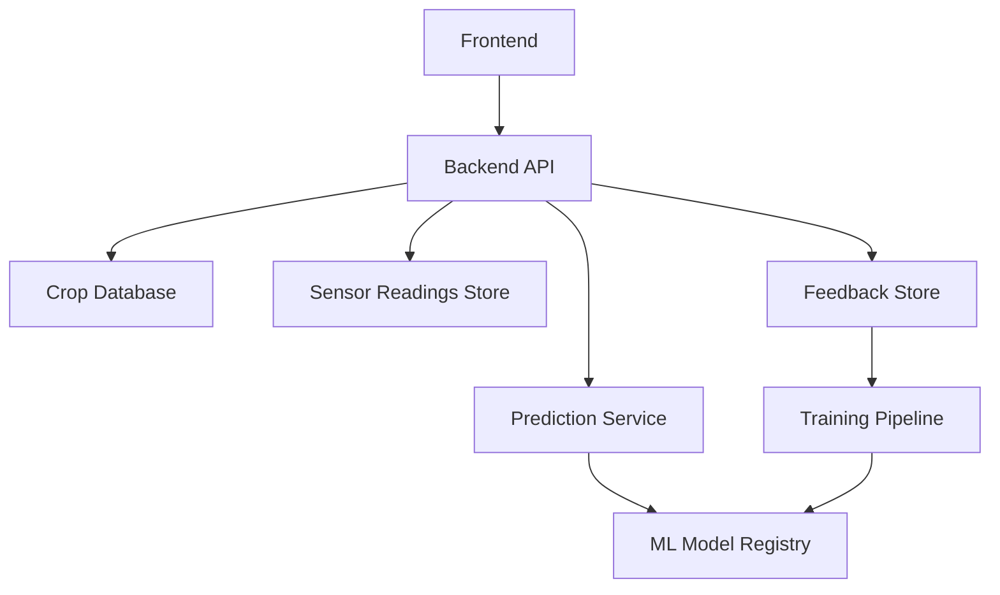

# Harvest Calendar Frontend System Design Plan

## 1. Product Summary

Harvest Calendar is a proof-of-concept frontend for a vertical farming harvest prediction system. The app starts with generic crop harvest estimates, monitors mocked sensor readings during the growth period, updates the predicted harvest window, and collects user feedback after harvest. That feedback is then shown as model-learning progress so users can understand how the system improves over time.

For the hackathon phase, the frontend will mock API calls, sensor data, and machine-learning behavior. The main goal is to prove the user journey and communicate the value of the learning loop.

## 2. Core Product Promise

Most farming dashboards monitor conditions. Harvest Calendar connects crop planning, environmental monitoring, prediction, and grower feedback into one learning loop.

The user should understand this loop within the first minute:

1. A crop is planted.
2. The app creates a generic harvest estimate.
3. Mocked sensors collect growing-condition data.
4. The prediction adjusts as conditions change.
5. The user confirms whether the harvest prediction was accurate.
6. The app shows that future predictions improve from feedback.

## 3. Frontend Scope

### In Scope

- Dashboard for active crops and upcoming harvests.
- Add crop flow with generic harvest estimate.
- Custom plant flow for plants that are not in the preset catalog.
- Harvest calendar with predicted harvest windows.
- Crop detail page with sensor trends and prediction explanation.
- Sensor assignment model that maps devices to rack, zone, and crop batch.
- Farm location setup for racks and zones that are not already listed.
- Edit, archive, cancel, and failed-crop flows so mistakes do not trap the user.
- Harvest feedback flow.
- Model learning summary page.
- Mock API layer for crops, sensors, predictions, and feedback.
- TanStack Query data layer for mocked API calls, caching, loading states, mutations, and invalidation.
- Mock ML behavior that reacts to crop conditions and feedback.
- Responsive UI for laptop demo and mobile-friendly viewing.

### Out of Scope For Part One

- Real backend.
- Real authentication.
- Real IoT sensor ingestion. The frontend will mock sensor devices and assignment.
- Real machine-learning training pipeline.
- Multi-tenant enterprise farm management.
- Hardware integration.
- Payment, billing, or admin controls.

## 4. Target Users

### Primary User

A vertical farm operator who manages crop batches across racks, zones, or grow trays. They want to know what is ready soon, what needs attention, and whether harvest predictions are becoming more reliable.

### Secondary User

A hackathon judge or stakeholder evaluating whether the idea can become a useful intelligent farming product.

## 5. Main User Journey

### Journey: First Crop Cycle

1. User opens the dashboard.
2. User clicks "Add Crop".
3. User selects a plant type such as lettuce, basil, spinach, or kale, or adds a custom plant profile.
4. User enters planting date, growing method, rack, zone, and plant count, creating a new rack/zone if needed.
5. User confirms which sensor group, rack, or zone will provide readings for this crop.
6. App creates a crop batch and returns a generic harvest estimate.
7. User sees the crop appear on the dashboard and calendar.
8. Mock sensor readings update the crop detail page.
9. Prediction moves earlier or later based on mocked growing conditions.
10. When the harvest date arrives, the app asks whether the prediction was accurate.
11. User submits actual harvest feedback.
12. App shows a learning confirmation and updates the model learning stats.
13. Future crop batches show higher confidence or adjusted estimates for similar crops.

### Journey: Returning User

1. User opens dashboard.
2. User sees active crops ranked by harvest urgency.
3. User notices one crop has a prediction shift because of sensor conditions.
4. User opens crop detail.
5. User reviews sensor trends and prediction explanation.
6. User acts on the crop or submits harvest feedback when ready.

## 6. Information Architecture

Recommended navigation:

- Dashboard
- Calendar
- Crops
- Sensors
- Learning

For a fast MVP, Dashboard, Add Crop, Crop Detail, Sensors, Calendar, and Learning are enough. Crop Detail can contain most sensor insights, while the Sensors page explains device placement and crop assignment.

## 7. Page And Feature Plan

### 7.1 Dashboard

Purpose: Give the user a quick farm status overview.

Key components:

- Active crop summary cards.
- Upcoming harvest list.
- Prediction confidence indicator.
- Environment health summary.
- Recent learning updates.
- Add crop button.

Primary content:

- Number of active batches.
- Number of crops ready soon.
- Average model confidence.
- Crop batches with current prediction and status.

Example card:

```text
Butterhead Lettuce
Planted: May 7
Generic estimate: Jun 6
Current prediction: Jun 4
Confidence: 76%
Status: Growing well
```

Dashboard behavior:

- Clicking a crop opens the crop detail page.
- Clicking "Add Crop" opens the add crop flow.
- Crops with harvest dates within 3 days should be visually prioritized.
- Crops with poor sensor conditions should show an attention state.

### 7.2 Add Crop Flow

Purpose: Let the user create a crop batch and immediately understand the baseline prediction.

Fields:

- Plant type.
- Custom plant name if the plant is not in the catalog.
- Generic maturity estimate for custom plants.
- Ideal growing ranges for custom plants, optional.
- Variety.
- Planting date.
- Growing method: hydroponic, soil, aeroponic.
- Rack or zone.
- Custom rack or zone if the growing location is not listed.
- Sensor group or assigned sensor devices.
- Number of plants.
- Optional notes.

Custom plant behavior:

- The plant selector should include an "Add custom plant" option.
- A custom plant starts with a user-provided baseline maturity estimate because the system has no historical model yet.
- Optional ideal ranges allow the mocked prediction engine to interpret sensor readings for the new plant.
- If the user does not provide ideal ranges, the system uses conservative default ranges and marks the model as `baseline`.
- After harvest feedback is submitted, the custom plant appears in Learning as a plant-specific model that is beginning to learn.

After submit:

- App creates a mocked crop batch.
- App shows generic estimate.
- App shows harvest window.
- App explains that prediction will improve as sensor data is collected.

Correction behavior:

- User can edit crop details after creation.
- User can change planting date, rack, zone, plant count, notes, and sensor assignment.
- User can archive duplicate or test crops.
- User can cancel a crop that was created by mistake.
- User can mark a crop as failed if the batch is lost before harvest.

Example result:

```text
Crop batch created.
Generic estimate: 30 days.
Expected harvest window: Jun 4 to Jun 8.
Prediction confidence: 48%.
```

### 7.3 Harvest Calendar

Purpose: Make the app feel like a real planning tool.

Views:

- Month view.
- Week view.
- List view.

Calendar item states:

- Generic estimate only.
- Sensor-adjusted prediction.
- Ready soon.
- Feedback needed.
- Completed.

Suggested color logic:

- Blue: generic baseline estimate.
- Green: high-confidence prediction.
- Yellow: medium confidence or small warning.
- Orange: attention needed.
- Gray: completed harvest.

Calendar interactions:

- Click calendar crop item to open crop detail.
- Filter by crop type, rack, zone, or readiness.
- Toggle between harvest date and harvest window display.

### 7.4 Crop Detail Page

Purpose: Show why the prediction changed and what the system has learned about this crop.

Sections:

- Crop summary header.
- Prediction panel.
- Growth timeline.
- Sensor charts.
- Prediction explanation.
- Harvest feedback call-to-action.

Prediction panel:

- Generic harvest date.
- Current predicted harvest date.
- Predicted harvest window.
- Confidence score.
- Days shifted from baseline.
- Current readiness status.

Example explanation:

```text
The original estimate was Jun 6.
Based on warmer average temperature and stable pH, the system now predicts Jun 4.
Confidence increased from 52% to 76% after 14 days of readings.
```

Sensor chart tabs:

- Temperature.
- Humidity.
- pH.
- EC or nutrient strength.
- Light exposure.
- Moisture or growing medium condition.

Each sensor card should include:

- Current reading.
- Ideal range.
- Trend direction.
- Impact on prediction.

Example:

```text
pH
Current: 5.9
Ideal: 5.5 - 6.5
Status: Optimal
Prediction impact: Confidence increased
```

### 7.5 Sensor Insights

Purpose: Translate raw sensor readings into understandable farming signals.

This can be a standalone page or embedded in Crop Detail.

Sensor ownership model:

- Sensors do not magically know the plant. They belong to a physical location or are assigned to a crop batch.
- For the PoC, each sensor device has a `rack`, `zone`, and optional `assignedBatchId`.
- When a crop is created, the user selects the rack/zone and may select a sensor group.
- The app links readings to the crop by matching `assignedBatchId` first, then `rack` and `zone`.
- If multiple active crops share the same rack/zone, the UI must ask the user to assign the sensor group to one crop batch to avoid ambiguous readings.

Insight types:

- "Temperature has stayed above ideal range for 3 days. Growth may accelerate."
- "Light exposure is below target. Harvest may shift 2 days later."
- "pH is stable. Confidence increased."
- "EC is low. Nutrient condition may delay maturity."

Insight severity:

- Good.
- Watch.
- Attention.

For the hackathon demo, insights should be deterministic and explainable, not random.

### 7.6 Sensor Assignment Page

Purpose: Show how the system knows which sensor readings belong to which crop batch.

This page answers the practical IoT question:

```text
A sensor belongs to a physical location or sensor group first. A crop receives readings when that group is assigned to the crop batch.
```

Key sections:

- Online sensor devices.
- Sensor groups by rack and zone.
- Assigned crop batch per sensor group.
- Unassigned sensor groups.
- Crops missing sensor assignment.
- Ambiguous rack/zone matches.

Assignment rules:

- Direct crop batch assignment wins.
- Sensor group assignment is the normal PoC path.
- Rack/zone fallback is allowed only when one active crop exists in that rack/zone.
- If multiple crops share the same rack/zone, the user must assign the sensor group explicitly.

User actions:

- Assign sensor group to crop.
- Change sensor group assignment.
- Open assigned crop detail page.
- See warning if a crop has no assigned sensors.

### 7.7 Harvest Feedback Flow

Purpose: Complete the learning loop.

Trigger:

- Crop reaches predicted harvest date.
- User marks crop as ready.
- Demo mode allows forcing a crop into feedback-needed state.

Questions:

- Was this crop ready to harvest?
- Was the prediction accurate?
- If off, how many days early or late?
- Actual harvest date.
- Harvest quality rating.
- Optional notes.

Feedback options:

- Accurate.
- Ready earlier.
- Ready later.
- Not ready yet.

If the user selects `Not ready yet`:

- Ask when to check again.
- Shift the predicted harvest date forward by the selected number of days.
- Keep the crop active instead of completed.
- Lower confidence slightly because the prior estimate was wrong.
- Show a new feedback prompt on the next check date.

After submit:

- Show confirmation.
- Update crop status to completed or still growing.
- Update learning stats.
- Show how the feedback affects future predictions.

Example confirmation:

```text
Feedback saved.
The lettuce model learned from this crop cycle.
Future lettuce predictions in similar conditions will shift 2 days earlier.
```

### 7.8 Farm Location Setup

Purpose: Let users create racks and zones instead of being blocked by a fixed list.

Location behavior:

- Add Crop should show existing farm locations.
- If the user cannot find the right rack or zone, they can create one inline.
- Sensors page can also manage rack and zone metadata.
- Sensor groups are attached to farm locations.
- Crop batches are attached to farm locations.

Minimum fields:

- Rack name.
- Zone name.
- Optional description.
- Optional growing method default.

This avoids a second fixed-list trap: unknown plants are handled by custom plant profiles, and unknown locations are handled by custom farm locations.

### 7.9 Model Learning Page

Purpose: Make the mocked ML value visible.

Sections:

- Model overview.
- Plant-specific model cards.
- Accuracy improvement chart.
- Feedback history.
- Generic vs learned model comparison.

Example plant card:

```text
Lettuce
Completed crop cycles: 124
Average error before learning: 5.2 days
Average error now: 1.8 days
Model confidence: High
```

Model maturity levels:

- Baseline: uses generic estimate.
- Learning: combines generic estimate with sensor trends.
- Adaptive: uses crop-specific historical patterns.

## 8. Frontend State Model

### Farm Location

```ts
type FarmLocation = {
  id: string;
  rack: string;
  zone: string;
  label: string;
  description?: string;
  defaultGrowingMethod?: "hydroponic" | "soil" | "aeroponic";
  status: "active" | "archived";
};
```

### Plant Profile

```ts
type PlantProfile = {
  id: string;
  name: string;
  variety?: string;
  source: "catalog" | "custom";
  defaultMaturityDays: number;
  harvestWindowBufferDays: number;
  idealRanges: {
    temperatureC?: {
      min: number;
      max: number;
    };
    humidityPercent?: {
      min: number;
      max: number;
    };
    ph?: {
      min: number;
      max: number;
    };
    ec?: {
      min: number;
      max: number;
    };
    lightHours?: {
      min: number;
      max: number;
    };
    moisturePercent?: {
      min: number;
      max: number;
    };
  };
  modelMaturity: "baseline" | "learning" | "adaptive";
};
```

### Crop Batch

```ts
type CropBatch = {
  id: string;
  plantProfileId: string;
  plantName: string;
  variety?: string;
  plantedAt: string;
  growingMethod: "hydroponic" | "soil" | "aeroponic";
  farmLocationId?: string;
  rack: string;
  zone: string;
  sensorGroupId?: string;
  assignedSensorIds: string[];
  plantCount: number;
  status: "growing" | "ready_soon" | "feedback_needed" | "completed" | "cancelled" | "failed" | "archived";
  genericHarvestDate: string;
  predictedHarvestDate: string;
  predictedHarvestWindow: {
    start: string;
    end: string;
  };
  confidence: number;
  predictionShiftDays: number;
  notes?: string;
};
```

### Sensor Device

```ts
type SensorDevice = {
  id: string;
  name: string;
  sensorTypes: SensorType[];
  farmLocationId?: string;
  rack: string;
  zone: string;
  sensorGroupId?: string;
  assignedBatchId?: string;
  status: "online" | "offline" | "maintenance";
};

type SensorType = "temperature" | "humidity" | "ph" | "ec" | "light" | "moisture";
```

### Sensor Group

```ts
type SensorGroup = {
  id: string;
  name: string;
  farmLocationId?: string;
  rack: string;
  zone: string;
  sensorIds: string[];
  assignedBatchId?: string;
};
```

### Sensor Reading

```ts
type SensorReading = {
  id: string;
  sensorId: string;
  sensorGroupId?: string;
  batchId?: string;
  rack: string;
  zone: string;
  timestamp: string;
  temperatureC: number;
  humidityPercent: number;
  ph: number;
  ec: number;
  lightHours: number;
  moisturePercent?: number;
};
```

### Prediction

```ts
type HarvestPrediction = {
  batchId: string;
  genericHarvestDate: string;
  predictedHarvestDate: string;
  windowStart: string;
  windowEnd: string;
  confidence: number;
  shiftDays: number;
  explanation: string;
  contributingFactors: PredictionFactor[];
};

type PredictionFactor = {
  label: string;
  status: "positive" | "neutral" | "negative";
  impact: string;
};
```

### Harvest Feedback

```ts
type HarvestFeedback = {
  id: string;
  batchId: string;
  predictedHarvestDate: string;
  actualHarvestDate: string;
  accuracy: "accurate" | "early" | "late" | "not_ready";
  daysOff: number;
  checkAgainInDays?: number;
  qualityRating: 1 | 2 | 3 | 4 | 5;
  notes?: string;
  submittedAt: string;
};
```

### Model Learning Stats

```ts
type ModelLearningStats = {
  plantProfileId: string;
  plantName: string;
  source: "catalog" | "custom";
  completedCycles: number;
  averageErrorBeforeDays: number;
  averageErrorAfterDays: number;
  confidence: number;
  maturityLevel: "baseline" | "learning" | "adaptive";
};
```

## 9. Mock API And Data Fetching Design

The frontend should use a small API abstraction so the mocked layer can later be replaced by a real backend. Even though the first version is mocked, all reads and writes should go through TanStack Query so the UI already behaves like a real networked application.

Recommended functions:

```ts
getFarmLocations(): Promise<FarmLocation[]>;
createFarmLocation(input: CreateFarmLocationInput): Promise<FarmLocation>;
updateFarmLocation(input: UpdateFarmLocationInput): Promise<FarmLocation>;
getPlantProfiles(): Promise<PlantProfile[]>;
createCustomPlantProfile(input: CreateCustomPlantProfileInput): Promise<PlantProfile>;
updatePlantProfile(input: UpdatePlantProfileInput): Promise<PlantProfile>;
getCropBatches(): Promise<CropBatch[]>;
getCropBatch(batchId: string): Promise<CropBatch>;
createCropBatch(input: CreateCropBatchInput): Promise<CropBatch>;
updateCropBatch(input: UpdateCropBatchInput): Promise<CropBatch>;
updateCropStatus(input: UpdateCropStatusInput): Promise<CropBatch>;
getSensorDevices(): Promise<SensorDevice[]>;
getSensorGroups(): Promise<SensorGroup[]>;
assignSensorGroupToBatch(input: AssignSensorGroupInput): Promise<SensorGroup>;
getSensorReadings(batchId: string): Promise<SensorReading[]>;
getPrediction(batchId: string): Promise<HarvestPrediction>;
submitHarvestFeedback(input: SubmitHarvestFeedbackInput): Promise<HarvestFeedback>;
getModelLearningStats(): Promise<ModelLearningStats[]>;
resetDemoData(): Promise<void>;
```

Recommended query hooks:

```ts
useFarmLocations();
usePlantProfiles();
useCropBatches();
useCropBatch(batchId);
useSensorDevices();
useSensorGroups();
useSensorReadings(batchId);
useHarvestPrediction(batchId);
useModelLearningStats();
useCreateCustomPlantProfile();
useUpdatePlantProfile();
useCreateFarmLocation();
useUpdateFarmLocation();
useCreateCropBatch();
useUpdateCropBatch();
useUpdateCropStatus();
useAssignSensorGroupToBatch();
useSubmitHarvestFeedback();
useResetDemoData();
```

Recommended query keys:

```ts
export const queryKeys = {
  farmLocations: ["farm-locations"] as const,
  plantProfiles: ["plant-profiles"] as const,
  cropBatches: ["crop-batches"] as const,
  cropBatch: (batchId: string) => ["crop-batches", batchId] as const,
  sensorDevices: ["sensor-devices"] as const,
  sensorGroups: ["sensor-groups"] as const,
  sensorReadings: (batchId: string) => ["sensor-readings", batchId] as const,
  prediction: (batchId: string) => ["predictions", batchId] as const,
  learningStats: ["learning-stats"] as const
};
```

Mutation behavior:

- `useCreateFarmLocation` should invalidate `farmLocations`, `sensorGroups`, and any Add Crop location selectors.
- `useUpdateFarmLocation` should invalidate `farmLocations`, `sensorGroups`, `sensorDevices`, `cropBatches`, and affected crop batches.
- `useCreateCustomPlantProfile` should invalidate `plantProfiles` and `learningStats`.
- `useUpdatePlantProfile` should invalidate `plantProfiles`, `cropBatches`, predictions for affected crops, and `learningStats`.
- `useCreateCropBatch` should invalidate `cropBatches`, `learningStats`, and any calendar data derived from crop batches.
- `useUpdateCropBatch` should invalidate the crop batch, crop list, readings, prediction, calendar data, and learning stats if plant profile changes.
- `useUpdateCropStatus` should invalidate the crop batch, crop list, calendar data, and learning stats.
- `useAssignSensorGroupToBatch` should invalidate `sensorGroups`, `sensorDevices`, the crop batch, crop list, readings, and prediction.
- `useSubmitHarvestFeedback` should invalidate the crop batch, crop list, prediction, and learning stats.
- `useResetDemoData` should clear local storage demo writes and invalidate all query keys.
- Optimistic updates are optional for the PoC, but loading and success states should be visible.
- Use short mock delays so the user can see the app handling real async behavior.

Mock API implementation rules:

- Return promises to mimic real network behavior.
- Add small artificial delays.
- Store user-created crops and submitted feedback in local storage through the mock API layer.
- Store custom plant profiles and sensor assignments in local storage through the mock API layer.
- Store farm locations, crop edits, archived crops, cancelled crops, failed crops, and demo reset state in local storage through the mock API layer.
- Keep seed demo data available on reload.
- Separate mock data from UI components.
- Do not call mock data directly from pages or components. Use TanStack Query hooks.
- `getSensorReadings(batchId)` should resolve the crop, find directly assigned sensor groups first, and fall back to matching rack/zone only when there is no ambiguity.
- Missing sensor types should return an explicit unavailable state instead of broken charts or empty metric cards.

Suggested folder structure:

```text
src/
  app/
    layout.tsx
    providers.tsx
    dashboard/
    calendar/
    crops/
    learning/
  components/
    crops/
    dashboard/
    feedback/
    sensors/
    ui/
  lib/
    mock-api/
      farm-locations.ts
      plant-profiles.ts
      crops.ts
      sensors.ts
      sensor-groups.ts
      predictions.ts
      learning.ts
      storage.ts
    mock-ml/
      calculate-prediction.ts
      ideal-ranges.ts
    query/
      keys.ts
      hooks.ts
    date-utils.ts
  types/
    location.ts
    plant.ts
    crop.ts
    sensor.ts
    prediction.ts
```

Provider setup:

```tsx
"use client";

import { QueryClient, QueryClientProvider } from "@tanstack/react-query";
import { useState } from "react";

export function Providers({ children }: { children: React.ReactNode }) {
  const [queryClient] = useState(
    () =>
      new QueryClient({
        defaultOptions: {
          queries: {
            staleTime: 30_000,
            refetchOnWindowFocus: false
          }
        }
      })
  );

  return <QueryClientProvider client={queryClient}>{children}</QueryClientProvider>;
}
```

## 10. Mock ML Behavior

The mocked model should feel logical and inspectable.

Prediction adjustment rules:

- Higher average temperature within acceptable range can shift harvest earlier.
- Low light exposure shifts harvest later.
- Stable pH increases confidence.
- pH outside ideal range decreases confidence.
- Low EC can shift harvest later.
- More completed crop cycles increase confidence.
- Recent feedback for the same plant profile adjusts future predictions.
- Custom plants use their `PlantProfile.defaultMaturityDays` and ideal ranges until enough feedback exists.
- If a custom plant has missing ideal ranges, prediction confidence should start lower and the explanation should say the system is using conservative defaults.

Example pseudo-logic:

`resolvedPlantProfile` means the plant profile after filling missing custom ranges with conservative defaults.

```ts
function calculateMockPrediction(batch, resolvedPlantProfile, readings, learningStats) {
  let shiftDays = 0;
  let confidence = resolvedPlantProfile.source === "custom" ? 38 : 48;

  if (average(readings.temperatureC) > resolvedPlantProfile.idealRanges.temperatureC.max) {
    shiftDays -= 1;
  }

  if (average(readings.lightHours) < resolvedPlantProfile.idealRanges.lightHours.min) {
    shiftDays += 2;
    confidence -= 8;
  }

  if (isStable(readings.ph)) {
    confidence += 10;
  }

  confidence += Math.min(learningStats.completedCycles / 5, 20);

  return {
    predictedHarvestDate: addDays(batch.genericHarvestDate, shiftDays),
    confidence,
    shiftDays
  };
}
```

The UI should describe these as model factors rather than hiding the logic.

## 10.1 Mock Crop Lifecycle Rules

The mock app needs deterministic lifecycle rules so crops naturally move through the demo.

Rules:

- `growing`: default state after crop creation.
- `ready_soon`: crop is within 3 days of the predicted harvest date.
- `feedback_needed`: current date is on or after predicted harvest date.
- `completed`: user confirms accurate, early, or late harvest feedback.
- `growing` after `not_ready`: user says the crop is not ready yet and chooses a next check date.
- `cancelled`: user cancels a crop created by mistake.
- `failed`: user marks a crop lost before harvest.
- `archived`: user hides a completed, cancelled, failed, or duplicate crop from active views.

`not_ready` behavior:

- Shift predicted harvest date by `checkAgainInDays`.
- Keep crop in active lists.
- Reduce confidence slightly.
- Add a timeline event explaining that feedback delayed the next check.

Archived, cancelled, and failed crops should not appear in default Dashboard or Calendar active views, but they should remain visible in Crops when the user enables the relevant status filter.

## 11. Demo Data Plan

Seed crops:

1. Butterhead Lettuce
   - Status: growing well.
   - Prediction shifted 2 days earlier.
   - Confidence: 76%.

2. Thai Basil
   - Status: attention needed.
   - Low light exposure.
   - Prediction shifted 2 days later.
   - Confidence: 61%.

3. Spinach
   - Status: feedback needed.
   - User can complete the feedback loop during the demo.
   - Confidence: 82%.

4. Kale
   - Status: generic baseline.
   - New crop with little sensor history.
   - Confidence: 47%.

Seed learning stats:

- Lettuce: adaptive model.
- Basil: learning model.
- Spinach: learning model.
- Kale: baseline model.

Seed sensor groups:

- Rack A / Zone 1: assigned to Butterhead Lettuce.
- Rack B / Zone 2: assigned to Thai Basil.
- Rack C / Zone 1: assigned to Spinach.
- Rack D / Zone 3: unassigned, available for new crops.

Seed farm locations:

- Rack A / Zone 1.
- Rack B / Zone 2.
- Rack C / Zone 1.
- Rack D / Zone 3.

## 12. Visual Design Direction

The UI should feel like an operational farming dashboard, not a marketing landing page.

Design principles:

- Calm, data-focused, and easy to scan.
- Use cards only for repeated crop summaries or small stat blocks.
- Use strong date and status hierarchy.
- Use charts sparingly and clearly.
- Prefer concise labels over explanatory paragraphs.
- Make confidence and harvest status visible without making the UI noisy.

Suggested palette:

- Background: off-white or very light neutral.
- Primary action: deep green.
- Healthy state: green.
- Warning state: amber.
- Attention state: orange or red.
- Baseline/generic state: blue.
- Completed state: muted gray.

Avoid:

- Overly decorative farm illustrations.
- Large marketing hero sections.
- Too many charts on one screen.
- Hiding the harvest prediction behind raw sensor data.

## 13. Component Plan

Reusable components:

- `AppShell`
- `TopNav`
- `SidebarNav`
- `PageHeader`
- `StatCard`
- `CropCard`
- `PredictionBadge`
- `ConfidenceMeter`
- `HarvestWindow`
- `SensorMetricCard`
- `SensorTrendChart`
- `SensorAssignmentCard`
- `FarmLocationSelector`
- `InsightList`
- `CalendarView`
- `AddCropForm`
- `FeedbackModal`
- `DemoResetDialog`
- `LearningModelCard`
- `AccuracyTrendChart`

shadcn/ui components to use:

- `button`
- `card`
- `badge`
- `dialog`
- `drawer`
- `form`
- `input`
- `select`
- `tabs`
- `table`
- `calendar`
- `popover`
- `progress`
- `toast` or `sonner`
- `skeleton`
- `alert`
- `separator`

Use shadcn/ui for the base interaction patterns, then customize with Tailwind utility classes. Avoid building custom form controls unless shadcn/ui does not cover the need.

Charting:

- Use Recharts for line charts and simple bar charts.
- Sensor readings should use compact line charts.
- Accuracy improvement can use a bar or line chart.

Calendar:

- Use a lightweight calendar library if it saves time.
- A custom month grid is acceptable for the hackathon if the interactions are simple.

## 14. Chosen Tech Stack

The frontend stack for the proof of concept is:

- Framework: Next.js App Router
- Language: TypeScript
- Styling: Tailwind CSS
- UI system: shadcn/ui
- Data fetching and cache: TanStack Query
- Charts: Recharts
- Icons: Lucide React
- Local UI state: React state
- Server/mock server state: TanStack Query
- Persistence for mocked writes: local storage behind the mock API layer
- Mocking: Local TypeScript mock API module
- Deployment: Vercel

Recommended packages:

```text
next
react
react-dom
typescript
tailwindcss
@tanstack/react-query
recharts
lucide-react
date-fns
class-variance-authority
clsx
tailwind-merge
```

shadcn/ui should be installed through its CLI and used as source-owned components inside the project. This makes it easy to customize components quickly during the hackathon.

Architecture rule:

- Use Server Components for static page shells where useful.
- Use Client Components for charts, forms, dialogs, query hooks, and interactive dashboard widgets.
- Keep TanStack Query hooks out of deeply nested presentational components when possible.
- Keep shadcn/ui primitives in `src/components/ui`.
- Keep domain components in `src/components/crops`, `src/components/sensors`, `src/components/feedback`, and `src/components/dashboard`.

## 15. Routing Plan

Suggested routes:

```text
/
/dashboard
/calendar
/crops
/crops/new
/crops/:batchId
/sensors
/learning
```

If using Next.js App Router:

```text
src/app/page.tsx
src/app/dashboard/page.tsx
src/app/calendar/page.tsx
src/app/crops/page.tsx
src/app/crops/new/page.tsx
src/app/crops/[batchId]/page.tsx
src/app/sensors/page.tsx
src/app/learning/page.tsx
```

Detailed page build specs live in:

```text
docs/frontend-pages/
```

Use those files when implementing each route. They define page purpose, required components, TanStack Query hooks, shadcn/ui usage, loading states, empty states, navigation behavior, and acceptance criteria.

## 16. Key UI States

Crop statuses:

- Growing.
- Ready soon.
- Feedback needed.
- Completed.
- Cancelled.
- Failed.
- Archived.

Prediction statuses:

- Generic baseline.
- Sensor adjusted.
- Low confidence.
- High confidence.

Sensor statuses:

- Optimal.
- Watch.
- Attention.
- Unavailable.
- Offline.

Sensor assignment statuses:

- Assigned.
- Missing.
- Ambiguous.
- Offline.

Feedback statuses:

- Not requested.
- Awaiting feedback.
- Submitted.
- Check again scheduled.

## 17. Hackathon Demo Script

The demo should follow a controlled story.

1. Open dashboard and show active crops.
2. Add a new lettuce crop and assign an available sensor group.
3. Show the generic prediction.
4. Open the crop detail page.
5. Show how the assigned sensor group explains where readings come from.
6. Show mocked sensor readings.
7. Show that the prediction shifted earlier due to good conditions.
8. Open Sensors and show the crop-to-sensor assignment.
9. Open calendar and show the updated harvest date.
10. Open a seeded spinach crop that needs feedback.
11. Submit feedback that the crop was ready 3 days earlier.
12. Show the learning confirmation.
13. Open the Learning page and show improved spinach or lettuce model stats.
14. Optional: add a custom plant profile to show how unsupported plants start with baseline estimates.
15. Explain that the backend and ML pipeline can replace the mocked API later without redesigning the journey.

## 18. Implementation Phases

### Phase 1: Skeleton And Data

- Set up Next.js App Router.
- Set up Tailwind CSS.
- Set up shadcn/ui.
- Set up TanStack Query provider.
- Add routes and layout.
- Define TypeScript types.
- Build mock data.
- Build mock API functions.
- Build query keys and query hooks.
- Build plant profile and sensor assignment mock storage.
- Build farm location, crop edit/status, and demo reset mock storage.

### Phase 2: Core Journey

- Build dashboard.
- Build add crop flow.
- Build crop detail page.
- Build sensors page.
- Build harvest calendar.
- Build edit crop and status action flows.

### Phase 3: Learning Loop

- Build feedback modal or page.
- Update mocked learning stats after feedback.
- Show learning confirmation.
- Build Learning page.

### Phase 4: Polish

- Add responsive behavior.
- Improve empty/loading/error states.
- Add chart visuals.
- Add demo-mode shortcuts.
- Add reset demo data action.
- Tune copy for judging clarity.

## 19. Acceptance Criteria

The frontend PoC is successful if:

- A user can create a crop batch.
- The app displays a generic harvest estimate.
- The user can create a custom plant profile when the plant is not in the catalog.
- The user can create a farm location when the rack or zone is not listed.
- The user can edit or archive a crop after creation.
- The user can assign a sensor group or sensor devices to a crop batch.
- The app shows mocked sensor data for the crop.
- Missing sensor types are shown as unavailable instead of breaking charts.
- The app updates the harvest prediction based on mocked conditions.
- The app clearly explains why the prediction changed.
- The user can submit harvest feedback.
- `Not ready yet` feedback keeps the crop active and schedules another check.
- The app updates the learning stats after feedback.
- Demo data can be reset to the original seeded state.
- Data reads and writes go through TanStack Query hooks.
- The UI uses shadcn/ui and Tailwind consistently.
- The whole journey can be demonstrated in under 5 minutes.

## 20. Future Backend Integration

The frontend should be built so the mocked API can later be replaced by real services.

Future backend services:

- User service.
- Crop batch service.
- Sensor ingestion service.
- Sensor registry and assignment service.
- Prediction service.
- Feedback service.
- Model training service.

Future integration flow:



The frontend should keep API calls isolated in `src/lib/mock-api` and query hooks isolated in `src/lib/query` so the real backend client can replace the mock layer later with minimal UI changes. TanStack Query should remain in place after the backend is added because it will still handle cache management, loading states, retries, invalidation, and mutation flows.

## 21. Main Product Risks

### Risk: The App Looks Like A Basic Calendar

Mitigation:

- Always show prediction confidence.
- Show sensor-driven prediction shifts.
- Include learning stats and feedback loop prominently.

### Risk: The ML Concept Feels Too Abstract

Mitigation:

- Use clear model explanations.
- Show before and after prediction error.
- Show plant-specific learning cards.

### Risk: The Demo Depends Too Much On Manual Explanation

Mitigation:

- Seed demo data that already tells the story.
- Include one crop that needs feedback.
- Include one crop with a visible prediction shift.

## 22. Recommended MVP Build Order

1. Define types and mock data.
2. Build dashboard.
3. Build crop detail.
4. Build add crop.
5. Build feedback flow.
6. Build learning page.
7. Build calendar.
8. Polish visual hierarchy and demo flow.

If time is short, prioritize Dashboard, Crop Detail, Feedback, and Learning. Those screens best prove the product idea.
